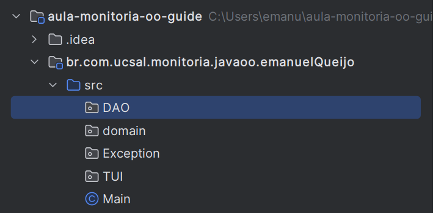

# Aula-Monitoria-OO-Guide


Seguiremos a orientação dessa [atividade](https://docs.google.com/document/d/18p-7S7QSl2tXeem1ws7X06EgSYS4JVh0dMEw_5cP3xc/edit) para realização do projeto


## Arquitetura em Camadas e pacotes


Vamos iniciar criando um projeto com o seguinte indentificador:  
```css
2023-2-monitoria-oo-atv01
```

Em seguida o pacote com a seguinte hierarquia:  
```css
br.com.ucsal.monitoria.javaoo."Seu nome"
```

Em seguida criaremos os seguintes pacotes dentro do pacote anterior:


### `Domain` (Domínio):
- Representa a camada de domínio.
- Contém regras de negócio e entidades principais.
- Foca em classes que representam conceitos centrais do aplicativo.

### `DAO` (Data Access Object):
- Responsável pela camada de persistência de dados.
- Contém lógica para acessar e manipular dados armazenados.
- Inclui classes como repositórios e adaptadores de acesso a dados.
- Promove métodos para criar, ler, atualizar e excluir (CRUD) objetos relacionados a dados.

### `Exception` (Exceção):
- Trata exceções específicas do domínio.
- Define classes de exceção personalizadas para erros do aplicativo.

### `TUI` (Text User Interface):
- Representa a interface de usuário baseada em texto.
- Cuida da interação por comandos de texto em uma CLI.
- Inclui classes para processar entradas, exibir saídas e gerenciar fluxos de texto.

Lembre-se de que essa é uma sugestão de organização, e a estrutura pode variar com base nas necessidades do projeto e nas convenções adotadas.


>A hierarquia de pacotes no Java é essencial para o desenvolvimento de software, organizando o código em unidades lógicas que facilitam a compreensão e manutenção. Ela evita conflitos de nomes, controla o acesso a classes, promove a reutilização de código, facilita a manutenção e contribui para o encapsulamento.

No final, a organização de pacotes deve estar assim: 


## Exception:

seguindo a orientação da atividade, criaremos a Classe exception:

```java
package Exception;
public class ProdutoException extends Exception {
    private static final long serialVersionUID = 1L;
    public ProdutoException(String message){
        super(message);
    }
    
}
```
>Aqui é definida uma classe chamada ``Exception``, que estende a classe ``java.lang.Exception``, Isso significa que a classe ``Exception`` é uma exceção verificada do java

>O ``serialVersionUID`` é usado para controlar a versão de serialização da classe. Isso é útil quando você está lidando com persistência de objetos em Java. A serialização em Java refere-se ao processo de converter um objeto em uma sequência de bytes, que pode ser posteriormente recriada para reconstituir o objeto original.


```java
  public Exception(String message){
        super(message);
    }
```

> esse construtor recebe uma mensagem como parametro, que é a mensagem que será exibida quando uma instancia dessa exceção for lançada. O construtor chama o contrutor da classe pai ``java.lang.Exception``, passando a mensagem


Basicamente usaremos esse cara para criar Exceptions personalizadas


## Domain:


Seguindo a orientação da atividade, criaremos a classe Produto

### classe ``Produto``

```java 
package domain;

public abstract class Produto {


    private Integer codigo;
    private String descricao;
    private Double valorUnitario;

    public Produto(){
    }

    public Produto(Integer codigo, String descricao, Double valorUnitario) {
        this.codigo = codigo;
        this.descricao = descricao;
        this.valorUnitario = valorUnitario;
    }

    public Integer getCodigo() {
        return codigo;
    }

    public void setCodigo(Integer codigo) {
        this.codigo = codigo;
    }

    public String getDescricao() {
        return descricao;
    }

    public void setDescricao(String descricao) {
        this.descricao = descricao;
    }

    public Double getValorUnitario() {
        return valorUnitario;
    }

    public void setValorUnitario(Double valorUnitario) {
        this.valorUnitario = valorUnitario;
    }

    @Override
    public String toString() {
        return "Produto{" +
                "codigo=" + codigo +
                ", descricao='" + descricao + '\'' +
                ", valorUnitario=" + valorUnitario +
                '}';
    }
}
```


>seguindo a orientação da atividade, deixaremos a classe Produto como abstract. Isso significa dizer que ela não pode ser instanciada diretamente, em vez disso ela serve de modelo para as classes que a extenderão;

```java

public abstract class Produto {
    ...
}
```

#### Atributos necessários:
```java
private Integer codigo;
private String descricao;
private Double valorUnitario;
```
>Seguindo a orientação da atividade, criaremos os atributos privados, juntamente com os metodos `get` e `set`, que são fornecidos para acessar e modificar atributos privados, promovendo um controle preciso sobre a manipulação dos dados. Isso aumenta a segurança, permite validações e facilita a evolução do código ao isolar as mudanças internas da interface externo

#### construtor parametrizado

>Seguindo a orientação da atividade, criaremos um construtor parametrizado com todos os atributos
```java
    public Produto(Integer codigo, String descricao, Double valorUnitario) {
        this.codigo = codigo;
        this.descricao = descricao;
        this.valorUnitario = valorUnitario;
    }
```
#### ToString

```java
    @Override
    public String toString() {
        return "Produto{" +
                "codigo=" + codigo +
                ", descricao='" + descricao + '\'' +
                ", valorUnitario=" + valorUnitario +
                '}';
    }
```
>Override do método toString(), que retorna uma representação de string do objeto. Esse método é frequentemente usado para imprimir informações úteis sobre o objeto. No caso, ele retorna uma string que contém o código, a descrição e o valor unitário do produto.

### Classe `Bolo`

```java
package domain;

public class Bolo extends Produto {


    private Integer quantFatias;
    private String tema;

    public Bolo() {
        super();
    }

    public Bolo(Integer codigo, String descricao, Double valorUnitario, Integer quantFatias, String tema) {
        super(codigo, descricao, valorUnitario);
        this.quantFatias = quantFatias;
        this.tema = tema;
    }

    public Integer getQuantFatias() {
        return quantFatias;
    }

    public void setQuantFatias(Integer quantFatias) {
        this.quantFatias = quantFatias;
    }

    public String getTema() {
        return tema;
    }

    public void setTema(String tema) {
        this.tema = tema;
    }
    
    @Override
    public String toString() {
        return "Bolo [quantFatias=" + quantFatias + ", tema=" + tema + ", getCodigo()=" + getCodigo()
                + ", getDescricao()=" + getDescricao() + ", getValorUnitario()=" + getValorUnitario() + "]";
    }
}

```

>atributos necessários, com base na atividade:

```java
  private Integer quantFatias;
    private String tema;
```

>Contrutores:

```java
  public Bolo() {
        super();
    }

    public Bolo(Integer codigo, String descricao, Double valorUnitario, Integer quantFatias, String tema) {
        super(codigo, descricao, valorUnitario);
        this.quantFatias = quantFatias;
        this.tema = tema;
    }
```
>A necessidade de chamar explicitamente o construtor da superclasse em uma subclasse, mesmo que a superclasse não tenha um construtor sem argumentos é uma prática necessária para garantir uma inicialização adequada e consistente dos objetos, especialmente quando se lida com hierarquias de classes.

### Classe `Doce`

```java
package domain;

import Exception.ProdutoException;

public class Doce extends Produto {


    private Integer minPedido;


    public Doce() {
        super();
    }

    public Doce(Integer codigo, String descricao, Double valorUnitario, Integer minPedido) {
        super(codigo, descricao, valorUnitario);
        this.minPedido = minPedido;
    }

    public Integer getMinPedido() {
        return minPedido;
    }

    public void setMinPedido(Integer minPedido) throws ProdutoException {
        validarMinPedido(minPedido);
        this.minPedido = minPedido;
    }

    public static void validarMinPedido(Integer minPedido) throws ProdutoException {
        if (minPedido < 50) {
            throw new ProdutoException("O Numero de doces é muito baixo para continuar a operação, Por Favor peça pelo menos 50 docinhoS S2");
        }

    }


    @Override
    public String toString() {
        return "Doce{" +
                "minPedido=" + minPedido +
                "} " + super.toString();
    }
}


```

> Seguindo a orientação da atividade, criamos os `construtores`, `gettes and setters`, e `ToString`. 

#### Função `validarMinPedido`

>Criamos a função que verifica se a quantidade de docinhos é maior que 50. Caso não seja, retorna uma Exception personalizada com a respectiva mensagem;

>Ela é chamada no ato de settar o valor para os docinhos 

```java

    public void setMinPedido(Integer minPedido) throws ProdutoException {
        validarMinPedido(minPedido);
        this.minPedido = minPedido;
    }

    public static void validarMinPedido(Integer minPedido) throws ProdutoException {
        if (minPedido < 50) {
            throw new ProdutoException("O Numero de doces é muito baixo para continuar a operação, Por Favor peça pelo menos 50 docinhoS S2");
        }

    }

```

## DAO:

### DoceriaDAO:

>Com Base na atividade, criaremos a classe `DoceriaDAO`, que vai ser responsavel pela persistencia dos dados
```java
package DAO;

import domain.Bolo;
import domain.Produto;

import java.util.ArrayList;
import java.util.Comparator;
import java.util.HashSet;
import java.util.List;

public class DoceriaDAO {

    private static List<Produto> produtos = new ArrayList<>();

    public static void adicionar(Produto produto) {
        produtos.add(produto);
    }


    public static List<Produto> listarPorOrdemCresteValorUnitarioEDescricao() {

        produtos.sort(Comparator.comparing(Produto::getValorUnitario).thenComparing(Produto::getDescricao));

        return produtos;
    }


    public static List<String> listarTemasTest() {
        List<String> lp = new ArrayList<String>();

        for (Produto produto : produtos) {
            if(produto instanceof  Bolo){
                lp.add(((Bolo) produto).getTema());
            }

        }

        return lp;
    }

    public static HashSet<String> listarTemasSemRepeticao() {
        HashSet<String> hsTemas = new HashSet<String>();

        for (Produto produto : produtos) {
            if (produto instanceof Bolo) {
                hsTemas.add(((Bolo) produto).getTema());
            }
        }

        return hsTemas;

    }

}


```

#### list de `Produtos`

```java
	private static List<Produto> produtos = new ArrayList<>();
```

>com base na atividade, criamos uma lista de produtos, nela salvaremos os Produtos do tipo Bolo e Doce

#### metodo `adicionar`
```java
public static void adicionar(Produto produto) {
		produtos.add(produto);
	}
```
> Esse cara adiciona Produtos a lista de produtos, sem misterio😎

#### metodo `obterTodosProdutos`
> Esse cara retorna todos os produtos cadastrados, nesse caso: Bolos e Doces. Sem misterio tambem 😎😎😎
```java
public static List<Produto> obterTodosProdutos() {
		return new ArrayList<>(produtos);
	}

```
#### metodo  `listarPorOrdemCresteValorUnitarioEDescricao`

```java 
	public static List<Produto> listarPorOrdemCresteValorUnitarioEDescricao() {

		produtos.sort(Comparator.comparing(Produto::getValorUnitario).thenComparing(Produto::getDescricao));

		return produtos;
	}
```
>[!IMPORTANT]
>
> O método listarPorOrdemCresteValorUnitarioEDescricao utiliza o método sort para ordenar a lista de produtos com base em dois critérios:

>`getValorUnitario`: Este é o critério principal de ordenação. Os produtos são ordenados de forma crescente com base no valor unitário.

>`getDescricao`: Este é o critério secundário de ordenação. Se houver produtos com o mesmo valor unitário, eles serão ordenados de forma crescente com base na descrição.

> O método `Comparator.comparing` é usado para especificar o critério principal (getValorUnitario), e o método thenComparing é usado para especificar o critério secundário (getDescricao). Isso cria uma ordem lexicográfica, onde os produtos são ordenados primeiro pelo valor unitário e, em caso de empate, pela descrição.

#### metodo `listarTemasSemRepeticao`

```java
    public static HashSet<String> listarTemasSemRepeticao() {
        HashSet<String> hsTemas = new HashSet<String>();

        for (Produto produto : produtos) {
            if (produto instanceof Bolo) {
                hsTemas.add(((Bolo) produto).getTema());
            }
        }
        return hsTemas;

    }
```
>Esse cara é usado para extrair os temas dos bolos a partir de uma lista de produtos, eliminando temas duplicados e retornando um conjunto contendo temas únicos.


```java
HashSet<String> hsTemas = new HashSet<String>();
```
>Esse cara é uma estrutura de dados do java que armazena elementos sem repetição.


```java
hsTemas.add(((Bolo) produto).getTema());
```
> Se o produto for um bolo, o tema desse bolo é adicionado ao HashSet. Para fazer isso, é necessário converter o produto para o tipo Bolo usando (Bolo) produto, e em seguida, chama-se o método getTema() para obter o tema específico do bolo.

## TUI:

### DoceriaTUI

> Com base na atividade criaremos a DoceriaTUI, que vai ser responsável pela interação do usuario com o sistema

```java
package TUI;

import DAO.DoceriaDAO;
import domain.Bolo;
import domain.Doce;
import Exception.ProdutoException;
import domain.Produto;


import java.util.InputMismatchException;
import java.util.Scanner;

public class DoceriaTUI {

    static Scanner scan = new Scanner(System.in);

    public static void cadastrarDoce() {
        try {
            System.out.println("Informe o Codigo do Doce");
            Integer codigo = scan.nextInt();
            System.out.println("Informe a descrição do Doce");
            scan.nextLine();
            String descricao = scan.nextLine();
            System.out.println("Informe o valor unitário do Doce");
            Double valorUnitario = scan.nextDouble();
            System.out.println("Informe a quantidade de Doces");
            Integer minPedido = scan.nextInt();
            Doce.validarMinPedido(minPedido);
            Doce doce = new Doce(codigo, descricao, valorUnitario, minPedido);
            DoceriaDAO.adicionar(doce);
            System.out.println("Doce cadastrado com sucesso");
        } catch (ProdutoException e) {
            System.out.println(e.getMessage());

        } catch (InputMismatchException e) {
            System.out.println("Valor digitado não é suportado");
        }
    }

    public static void cadastrarBolo() {
        try {
            System.out.println("Informe o Codigo do Bolo");
            Integer codigo = scan.nextInt();
            System.out.println("Informe a descrição do Bolo");
            scan.nextLine();
            String descricao = scan.nextLine();
            System.out.println("Informe o valor unitário do Bolo");
            Double valorUnitario = scan.nextDouble();
            System.out.println("Informe a quantidade de fatias do Bolo");
            Integer quantFatias = scan.nextInt();
            System.out.println("Informe o Tema do Bolo");
            scan.nextLine();
            String tema = scan.nextLine();
            Bolo bolo = new Bolo(codigo, descricao, valorUnitario, quantFatias, tema);
            DoceriaDAO.adicionar(bolo);
            System.out.println("Bolo cadastrado com sucesso");
        } catch (InputMismatchException e) {
            System.out.println("Valor digitado não é suportado");
        }

    }

    public static void listarProdutosPorValorEDescricao() {

        for (Produto produto : DoceriaDAO.listarPorOrdemCresteValorUnitarioEDescricao()) {
            System.out.println(produto.toString());
        }

    }


    public static void listarTemas() {

        System.out.println("Temas de bolos cadastrados: ");
        for (String tema : DoceriaDAO.listarTemasSemRepeticao()) {
            System.out.println(tema);
        }
    }

}
```

#### `Scanner`

```java
    static Scanner scan = new Scanner(System.in);
```
> Deixei esse cara como static par apoder user ele na classe inteira, sem precisar chamar em cada metodo


#### method `cadastrarBolo`

```java

    public static void cadastrarBolo() {
        try {
            System.out.println("Informe o Codigo do Bolo");
            Integer codigo = scan.nextInt();
            System.out.println("Informe a descrição do Bolo");
            scan.nextLine();
            String descricao = scan.nextLine();
            System.out.println("Informe o valor unitário do Bolo");
            Double valorUnitario = scan.nextDouble();
            System.out.println("Informe a quantidade de fatias do Bolo");
            Integer quantFatias = scan.nextInt();
            System.out.println("Informe o Tema do Bolo");
            scan.nextLine();
            String tema = scan.nextLine();
            Bolo bolo = new Bolo(codigo, descricao, valorUnitario, quantFatias, tema);
            DoceriaDAO.adicionar(bolo);
            System.out.println("Bolo cadastrado com sucesso");
        } catch (InputMismatchException e) {
            System.out.println("Valor digitado não é suportado");
        }

```
>Esse cara vai receber os atributos necessários para criar um novo bolo, Fazendo as validções necessárias e, no fim, salvando em uma lista de Produtos. E, caso aconteça algum erro, exibe uma mensagem de erro.


#### method `cadastrarDoce`

```java
 public static void cadastrarDoce() {
        try {
            System.out.println("Informe o Codigo do Doce");
            Integer codigo = scan.nextInt();
            System.out.println("Informe a descrição do Doce");
            scan.nextLine();
            String descricao = scan.nextLine();
            System.out.println("Informe o valor unitário do Doce");
            Double valorUnitario = scan.nextDouble();
            System.out.println("Informe a quantidade de Doces");
            Integer minPedido = scan.nextInt();
            Doce.validarMinPedido(minPedido);
            Doce doce = new Doce(codigo, descricao, valorUnitario, minPedido);
            DoceriaDAO.adicionar(doce);
            System.out.println("Doce cadastrado com sucesso");
        } catch (ProdutoException e) {
            System.out.println(e.getMessage());

        } catch (InputMismatchException e) {
            System.out.println("Valor digitado não é suportado");
        }
    }
```
>Esse cara vai receber os atributos necessários para criar um novo doce, Fazendo as validções necessárias e, no fim, salvando em uma lista de Produtos. E, caso aconteça algum erro, exibe uma mensagem de erro.


#### função `listarProdutosPorValorEDescricao` 

```java
    public static void listarProdutosPorValorEDescricao() {

        for (Produto produto : DoceriaDAO.listarPorOrdemCresteValorUnitarioEDescricao()) {
            System.out.println(produto.toString());
        }

    }
```
> Esse cara vai chamar o methodo `listarProdutosPorValorEDescricao` da `ProdutoDAO` e vai exibir na tela, Sem segredo 😎😎 


#### função `listarTemas`

```java
    public static void listarTemas() {

        System.out.println("Temas de bolos cadastrados: ");
        for (String tema : DoceriaDAO.listarTemasSemRepeticao()) {
            System.out.println(tema);
        }
    }
```
> Esse cara vai chamar o metodo `listarTemasSemRepeticao` da `ProdutoDAO` e vai exibir eles na tela, basikão😎😎😎😎😎😎😎😎😎😎😎😎😎

